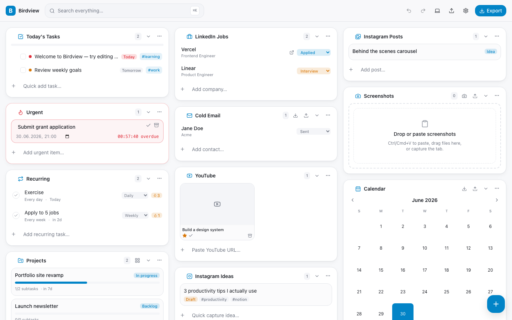
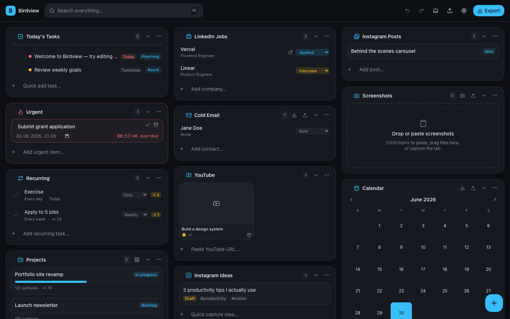

<div align="center">

# 🐦 Birdview

### A local-first visual productivity dashboard for your browser

**Notion + Trello + Pinterest + Google Keep — distilled into one fast, private, offline-capable workspace that lives entirely on your device.**

[](https://github.com/ahk-d/birdview/actions/workflows/ci.yml)
[](LICENSE)


No login · No cloud · No tracking · Works offline · Chrome · Edge · Brave · Arc · Opera · Firefox



</div>

---

## Why Birdview?

Most productivity tools want your account, your data, and a network connection. Birdview wants none of that. Everything you capture — tasks, projects, job applications, content ideas, screenshots — is stored **locally** in your browser and never leaves your machine. It loads in well under a second, works on a plane, and turns every new browser tab into a calm, beautiful command center.

## Features

| | Module | What it does |
|---|---|---|
| ✅ | **Today's Tasks** | Checklists, priorities, due dates, progress bar, drag-reorder, labels, reminders |
| 🔥 | **Urgent** | Red-accented items with live countdown timers and overdue states |
| 🔁 | **Recurring** | Daily/weekly/monthly habits that auto-regenerate, with streaks |
| 📁 | **Projects** | Subtasks, links, attachments, tags + a full **Kanban board** |
| 💼 | **LinkedIn Jobs** | Application pipeline (Saved → Offer), salary, recruiter, follow-ups |
| 📧 | **Cold Email** | Outreach pipeline with **CSV import/export** |
| ▶️ | **YouTube** | Watch list with auto thumbnails, favorite / watched / archive |
| 📸 | **Instagram Ideas** | Caption + hashtag + inspiration-image capture |
| in | **LinkedIn / Instagram Planners** | Plan posts from Idea → Published with dates and hashtags |
| 🖼️ | **Screenshots** | Paste (`Ctrl/Cmd+V`), drag-drop, or capture the tab → IndexedDB inbox |
| 📅 | **Calendar** | Month view with `.ics` import/export (Google / Outlook / Apple) |

**Plus everywhere:** `⌘/Ctrl+K` global fuzzy search & command palette · quick-capture popup + floating button · drag-and-drop masonry layout · light / dark / system themes · undo/redo · one-click **export to Notion**, JSON, Markdown, CSV, or full **ZIP backup with images** · configurable reminders · universal `#tags`.

<div align="center">

</div>

## Tech stack

TypeScript · React 18 · Vite + [@crxjs/vite-plugin](https://crxjs.dev) · TailwindCSS · Headless UI · Framer Motion · lucide-react · @dnd-kit · Fuse.js · Zustand · idb · webextension-polyfill · Vitest · Playwright.

## Quick start

```bash
pnpm install
pnpm dev          # web preview of the dashboard at http://localhost:5173
```

`pnpm dev` runs the dashboard as a plain web app (extension APIs are shimmed to `localStorage`) — the fastest way to iterate.

## Install the extension

```bash
pnpm build            # → dist/          (Chromium MV3)
pnpm build:firefox    # → dist-firefox/  (Firefox MV3)
pnpm zip              # → birdview.zip   (store-ready package of dist/)
```

<details>
<summary><b>Chrome / Edge / Brave / Arc / Opera</b></summary>

1. `pnpm build`
2. Open `chrome://extensions` and enable **Developer mode**.
3. **Load unpacked** → select the `dist/` folder.
</details>

<details>
<summary><b>Firefox</b></summary>

1. `pnpm build:firefox`
2. Open `about:debugging#/runtime/this-firefox`.
3. **Load Temporary Add-on** → pick any file inside `dist-firefox/`.

Or run it instantly in a throwaway profile: `npx web-ext run --source-dir dist-firefox`.
</details>

> Once installed, every **new tab** opens the Birdview dashboard (a manifest new-tab override). The toolbar icon opens quick-capture.

## Scripts

| Script | Description |
| --- | --- |
| `pnpm dev` | Vite dev server (web preview) |
| `pnpm build` / `pnpm build:firefox` | Build the Chromium / Firefox extension |
| `pnpm zip` | Package `dist/` into a store-ready zip |
| `pnpm typecheck` | `tsc` project references, no emit |
| `pnpm lint` / `pnpm format` | ESLint / Prettier |
| `pnpm test` / `pnpm test:e2e` | Vitest unit tests / Playwright smoke tests |

## Keyboard shortcuts

| Key | Action | Key | Action |
| --- | --- | --- | --- |
| `⌘/Ctrl + K` or `/` | Search & command palette | `N` / `P` / `J` | New task / project / job |
| `C` | Quick capture | `⌘/Ctrl + Z` / `⇧⌘Z` | Undo / redo |

## Architecture

```
src/
  types/            Domain types + database schema
  storage/          schema (defaults + migration), db (JSON store), images (IndexedDB), seed
  services/         store (Zustand + undo/redo), search, ics, csv, export, import,
                    recurring, notifications, ui, browser shim
  hooks/            useDebounce, useHotkeys, useTheme, useMediaQuery, useImageURL
  components/       Reusable UI library (Card, Modal, Menu, Toast, FAB, TagInput, …)
  features/         One folder per module + registry.ts
  layouts/          DashboardLayout (masonry + drag-and-drop)
  command-palette/  Raycast-style palette
  pages/            dashboard, popup, sidepanel, settings
  background/       MV3 service worker (alarms → notifications, context menu, commands)
```

A single Zustand store is hydrated from the local database; every mutation is optimistic, persisted via debounced autosave, and recorded for undo/redo. Modules self-register in `features/registry.ts`, and the dashboard renders them in a persisted, reorderable masonry. Render errors are isolated per-card by error boundaries, and corrupted data is healed on load.

## Privacy

Birdview stores **everything locally** — `chrome.storage.local` for records, IndexedDB for images. No servers, no accounts, no telemetry. Calendar sync is file-based (`.ics`), so it interoperates with Google/Outlook/Apple Calendar without account access.

## Roadmap / notes

- OCR for screenshots is stubbed (`runOcr` in `storage/images.ts`) — wire a lazy-loaded Tesseract.js worker to enable it; search already reads `screenshot.ocrText`.
- Calendar is ICS-only by design (local-first). OAuth Google/Outlook sync is intentionally out of scope.

## License

[MIT](LICENSE) © 2026 ahk-d
